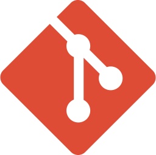
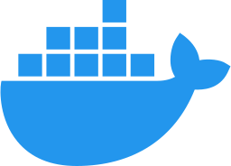

# Hi, I'm Rachel!

A software engineer with a love for hiking, mixology, and gaming. 

## Tech Stack
    
    

## Portfolio

Learn a little bit more about me and check out my latest work!

### <a href="https://rachel-hassett.netlify.app/about">Rachel Hassett</a>

## Work Desk

Currently I am working on:

- Learning C#
- Creating an app for planning dates and hangouts
- Icebox features from past projects